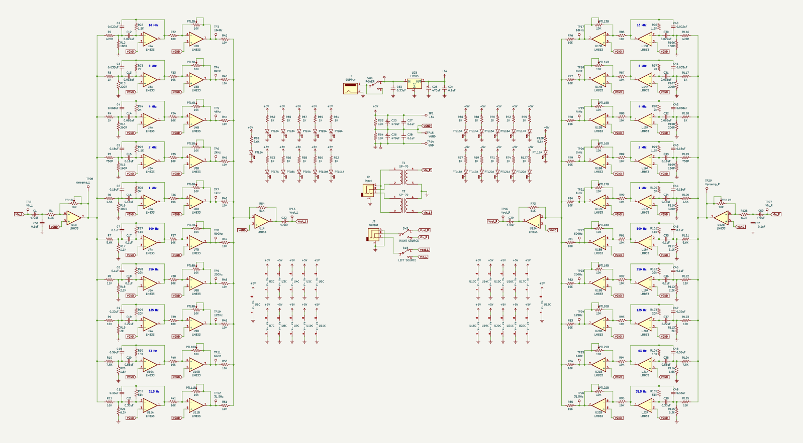
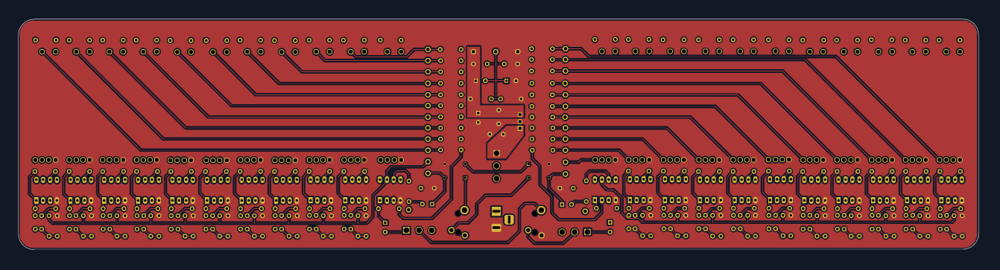
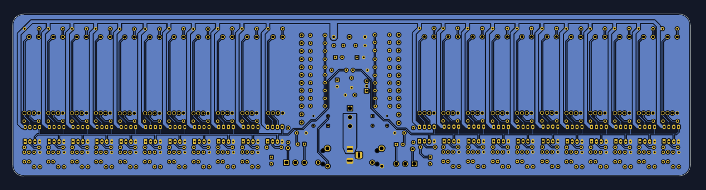
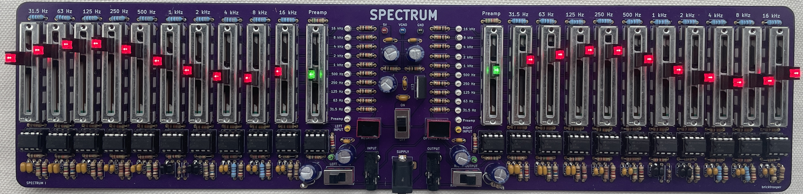

# Spectrum

Spectrum is a 10-band stereo graphic equalizer circuit.  It uses active band pass filters in the multiple feeedback configuration.  Each band can be individually amplified or attenuated using linear potentiometers.  The circuit requires an external power source of at least 5 V at 250 mA.

## Background

### Graphic Equalizers

A graphic equalizer is a piece of audio equipment that isolates different ranges of frequencies from an audio signal.  These ranges can then be individually amplified (boosted) or attenuated (cut).  The modified signals are mixed back together into a single audio signal which appears at the output.  The resulting signal is the same audio but with each frequency range adjusted with a desired gain.

### Stereo Sound

The most basic form of electrical audio signals is "mono".  This is a single audio signal that plays through all the speakers.  "Stereo" uses two separate audio signals that differ slightly but can be used to give the perception of spatial audio.  Typically, the signals are used to drive separate "left" and "right" speakers.  A graphic euqalizer only operates on a single mono signal, so Spectrum effectively uses two identical circuits to module both channels of stereo audio.  The resulting output can be played through stereo headphones.  The circuit must be powered by an external wall adapter or any other 5 V source that can supply approximately 200 mA of current.

## Circuit Design

### Power Supply

Spectrum uses a 5 V power supply that is regulated by an L7805 power supply IC.  Traditionally, operational amplifiers use a bipolar supply of +VDD and -VDD, with the ground point of the signal being 0 V.  This is not possible with a single supply.  Therefore, Spectrum raises the ground point to a virtual ground of VDD / 2, or 2.5 V.  The op amps are supplied by 5 V and sink to 0 V (GND).  This provides 2.5 V of signal swing, which is enough for driving headphones to a considerable volume.  To drive large speakers, a separate amplifier should be used.

### Preamplifier

The preamplifier's job is to drive the the rest of the circuit, effectively isolating the input resistance of the circuit from the audio source.  This is important because headphone jacks cannot drive very high impedances.  The preamplifer is also capable of amplifying or attentuating the input signal.  Amplification may be required if the input source is too quiet, while attentuation can be used to reduce distortion in the output signal.  The input to the preamplifier is further isolated using a 1:1 audio transformer.  This prevents the ground of the circuit from creating a ground loop through the audio cable, which creates an undesireable humming noise due to the oscillation of the AC mains voltage.  The preamplifier is implemented as a simple inverting amplifier.  A capacitor is used at the input to strip out any existing DC voltage and the output signal is re-biased at the virtual ground point.  A potentiometer is used in the feedback resistance to amplify or attentuate the signal linearly.

### Band Pass Filters

The core circuit of a graphic equalizer is the band pass filter, which isolates a range of frequencies.  Different resistor and capacitor values are used to achieve different cutoff frequencies over the bass, mid, and treble ranges.  Spectrum uses 10 filters for each audio channel.  The centre frequncies are:

- 31.5 Hz
- 63 Hz
- 125 Hz
- 250 Hz
- 500 Hz
- 1 kHz
- 2 kHz
- 4 kHz
- 8 kHz
- 16 kHz

These are active filters that used op amps in the multiple-feedback configuration, which allows the cutoff frequency to be changed without affecting the gain of the centre frequency.  The gain of all the filters have been adjusted so that the entire audio range has a flat gain of approximately 2 V/V when the filters outputs are mixed back together.

### Band Amplifiers

Each band pass filter is followed by it's own inverint amplifier, which has adjustable gain via a potentiometer in the feedback path.  This allows the user to individually boost or cut different frequency ranges.  When all potentiometers are at their midpoints, the gain will be 1 V/V across the entire range, since the gain of each amplifier is 0.5 V/V at this point.  This means that the band amplifiers can cut down to 0 V/V or up to a maximum of 2 V/V.  Any further amplification must be provided from the audio source and the preamplifier.

### Mixer

The mixer is a summing amplifier that re-combines all the band signals back into a single audio signal.  It has a fixed gain, and the output signal can directly drive low-impedance headphones.  The output signal runs through a large capacitor to cut out the virtual ground DC bias to avoid damaging the headphone speaker coils.  This turns the signal into an AC waveform with a GND as the reference point.

## Schematic

## Circuit Board

### Top

### Bottom

### Assembled

## Revisions

- A 470R resistor was added to the audio output to mitigate the amplified hissing noise.  The side effect of this is reduced gain from the preamp.  This could potentially be addressed by using a preamp with a larger maximum gain.
